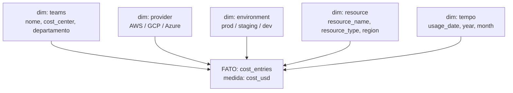

# Modelo Dimensional

Esta página descreve o modelo sob a ótica de **Data Warehouse** — separando **tabelas fato** de **tabelas dimensão** — e lista as **perguntas de negócio** que o pipeline consegue responder.

## Star schema (parcialmente desnormalizado)

O domínio FinOps forma uma **estrela**: um fato central de custo cercado por dimensões que permitem fatiar a análise (*slice & dice*).

!!! info "Estrela desnormalizada"
    Só `teams` é uma **dimensão física** (tabela própria, ligada por `team_id`). As demais — `provider`, `environment`, `resource_*`, `region` e a data — são **dimensões degeneradas**: ficam embutidas no próprio fato em vez de virar tabelas separadas. É uma escolha comum em data lake/medallion, que simplifica o modelo sem perder capacidade analítica.

## Tabelas fato

### `cost_entries` — fato transacional (fonte)
- **Grão:** um lançamento de custo por recurso, por dia.
- **Medida:** `cost_usd` (aditiva — somável por qualquer dimensão).
- É a tabela em torno da qual todo o pipeline gira.

### `budgets` — fato de alvo (*target*)
- **Grão:** orçamento aprovado por time × provedor × mês.
- **Medida:** `amount_usd`.
- Cruzado com o fato de custo para calcular **utilização** e **estouro de orçamento**.

## Tabelas dimensão

| Dimensão | Tipo | Atributos | Permite analisar por... |
|---|---|---|---|
| `teams` | Física | nome, cost_center, departamento, dono | **time** |
| `provider` | Degenerada | AWS / GCP / Azure | **provedor de nuvem** |
| `environment` | Degenerada | prod / staging / dev | **ambiente** |
| `resource` | Degenerada | resource_name, resource_type, region | **recurso / tipo / região** |
| tempo | Degenerada | usage_date, year, month | **período** |

## Marts da camada Gold

As tabelas `finops_gold.*` são **fatos agregados** (sumarizações pré-calculadas) — cada uma materializa as respostas de uma pergunta de negócio para consumo direto no Metabase.

| Mart | Agregação | Dimensões |
|---|---|---|
| `monthly_cost_by_team` | custo vs budget + % utilização + flag de estouro | time × provedor × mês |
| `cost_trend_by_provider` | custo mensal + variação Month-over-Month | provedor × mês |
| `cost_by_environment` | custo + % do total | ambiente × mês |
| `top_resources` | ranking dos recursos mais caros | recurso × mês |

## Perguntas de negócio respondidas

Organizadas pela dimensão usada para fatiar a análise:

| Dimensão | Pergunta | Mart |
|---|---|---|
| **Time** | Quanto cada time gasta? Quem estourou o orçamento e em quanto? | `monthly_cost_by_team` |
| **Provedor** | Qual nuvem custa mais? O custo está subindo ou caindo (MoM)? | `cost_trend_by_provider` |
| **Ambiente** | Quanto vai para prod vs staging/dev? Há desperdício fora de produção? | `cost_by_environment` |
| **Recurso** | Quais são os recursos mais caros? Onde concentrar otimização? | `top_resources` |
| **Tempo** | Como o gasto evolui mês a mês? Qual a tendência? | todos (year/month) |

Exemplos concretos (com os dados de seed atuais):

- *"O time Mobile estourou o orçamento de Azure?"* → sim, chegou a **310%** de utilização.
- *"O custo da AWS está crescendo?"* → série mensal com variação MoM por provedor.
- *"Estamos gastando demais em ambientes não-produtivos?"* → % de custo por ambiente.
- *"Quais os 10 recursos mais caros do mês?"* → ranking em `top_resources`.
- *"Qual o gasto total e quantos times estão acima do orçamento?"* → KPIs do dashboard (**$118 mil**, **35** estouros em 144 combinações).

## Limites do modelo atual

Vale registrar o que **ainda não** é respondível pelos marts (oportunidades de evolução):

- **Custo por região** ou por **tipo de recurso agregado**: existe no fato `cost_entries`, mas nenhum mart Gold expõe esse corte ainda.
- **Previsão de custo (forecast)**: o modelo é histórico/descritivo; não há projeção futura.
