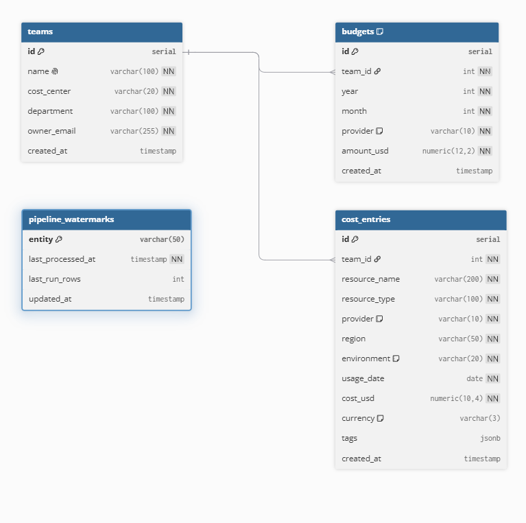

# Modelo Relacional

## Diagrama ER — Schema `finops_source` (PostgreSQL)

> Relacionamentos: `teams` 1:N `budgets` e `teams` 1:N `cost_entries` (via `team_id`).
> `pipeline_watermarks` é tabela de controle do pipeline, sem relacionamento.

## Tabelas da origem

### `finops_source.teams`

Representa os times responsáveis por recursos de cloud.

| Coluna | Tipo | Obrigatório | Descrição |
|---|---|---|---|
| `id` | SERIAL | PK | Identificador único |
| `name` | VARCHAR(100) | ✓ UNIQUE | Nome do time |
| `cost_center` | VARCHAR(20) | ✓ | Código contábil (ex: CC-001) |
| `department` | VARCHAR(100) | ✓ | Departamento |
| `owner_email` | VARCHAR(255) | ✓ | E-mail do responsável |
| `created_at` | TIMESTAMP | auto | Data de criação |

**Dados de seed:** 8 times — Platform, Data, Frontend, Backend, Mobile, ML, Security, DevOps.

---

### `finops_source.budgets`

Orçamento mensal aprovado por time, por mês e por provedor de cloud.

| Coluna | Tipo | Obrigatório | Descrição |
|---|---|---|---|
| `id` | SERIAL | PK | Identificador único |
| `team_id` | INT | FK → teams | Time dono do orçamento |
| `year` | INT | ✓ | Ano de referência |
| `month` | INT | ✓ CHECK 1-12 | Mês de referência |
| `provider` | VARCHAR(10) | ✓ CHECK | `AWS`, `GCP` ou `Azure` |
| `amount_usd` | NUMERIC(12,2) | ✓ > 0 | Valor orçado em USD |
| `created_at` | TIMESTAMP | auto | Data de criação |

**Unique constraint:** `(team_id, year, month, provider)` — um budget por combinação.  
**Dados de seed:** 8 times × 3 provedores × 6 meses = 144 registros.

---

### `finops_source.cost_entries`

Tabela fato central: registro diário de custo de cada recurso de cloud.

| Coluna | Tipo | Obrigatório | Descrição |
|---|---|---|---|
| `id` | SERIAL | PK | Identificador único |
| `team_id` | INT | FK → teams | Time responsável pelo recurso |
| `resource_name` | VARCHAR(200) | ✓ | Nome do recurso (ex: `ec2-data-abcd`) |
| `resource_type` | VARCHAR(100) | ✓ | Tipo (EC2, S3, BigQuery, etc.) |
| `provider` | VARCHAR(10) | ✓ CHECK | `AWS`, `GCP` ou `Azure` |
| `region` | VARCHAR(50) | ✓ | Região (ex: `us-east-1`) |
| `environment` | VARCHAR(20) | ✓ CHECK | `prod`, `staging` ou `dev` |
| `usage_date` | DATE | ✓ | Data do lançamento |
| `cost_usd` | NUMERIC(10,4) | ✓ ≥ 0 | Custo do dia em USD |
| `currency` | VARCHAR(3) | DEFAULT USD | Moeda (sempre USD após normalização) |
| `tags` | JSONB | — | Tags livres (ex: `{"env": "prod"}`) |
| `created_at` | TIMESTAMP | auto | Data de ingestão |

**Índices:**
- `(team_id, usage_date)` — consultas por time e período
- `(provider, usage_date)` — consultas por provedor e período
- `(usage_date)` — consultas por data

**Dados de seed:** ~20.000 registros de 6 meses.

## Tabelas Gold — Schema `finops_gold` (PostgreSQL)

Tabelas preenchidas pelo notebook `05_gold_load_postgres.ipynb`. São a fonte do Metabase.

### `finops_gold.monthly_cost_by_team`

Custo real vs budget por time, provedor e mês.

| Coluna | Tipo | Descrição |
|---|---|---|
| `year` | INT | Ano |
| `month` | INT | Mês |
| `team_id` | INT | ID do time |
| `team_name` | VARCHAR | Nome do time |
| `provider` | VARCHAR | Provedor |
| `total_cost_usd` | NUMERIC | Custo real acumulado |
| `budget_usd` | NUMERIC | Budget aprovado |
| `budget_utilization_pct` | NUMERIC | (custo/budget)×100 |
| `is_over_budget` | BOOLEAN | Custo > Budget |
| `loaded_at` | TIMESTAMP | Data da carga |

### `finops_gold.top_resources`

Top recursos por custo no mês (rank mensal).

### `finops_gold.cost_trend_by_provider`

Série temporal de custo mensal por provedor com variação MoM.

### `finops_gold.cost_by_environment`

Custo mensal por ambiente com % do total.

## Tipos de recurso por provedor

| AWS | GCP | Azure |
|---|---|---|
| EC2 | Compute Engine | Virtual Machines |
| S3 | Cloud Storage | Blob Storage |
| RDS | Cloud SQL | SQL Database |
| Lambda | Cloud Run | Functions |
| EKS | GKE | AKS |
| CloudFront | — | — |
| ElastiCache | — | Redis Cache |
